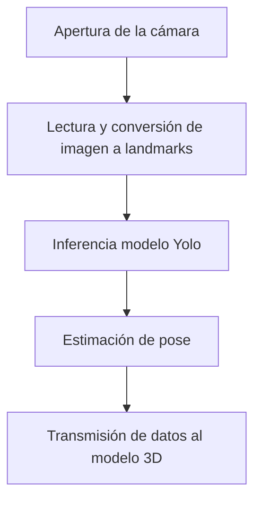

# Proyecto de Visión/3D + Control en Tiempo Real

Este repositorio contiene una aplicación Python para visión por computador y/o control de un modelo 3D en tiempo real (p. ej., OpenCV + YOLO + Panda3D).

## Requisitos


## Estructura 
```
assets/
  models/              # Modelos (.pt, .onnx, .pkl, etc.)
tests/                 # Pruebas unitarias (pytest)
src/                   # Archivos source del proyecto
main.py                # Punto de entrada por defecto 
pyproject.toml         # PEP 621 (opcional)
requirements.txt       # Requerimientos 
Makefile               # Tareas comunes
```

**Pipeline (resumen):**



## Arquitectura del Proyecto

El proyecto sigue una arquitectura limpia (Clean Architecture), organizada en capas que separan responsabilidades y favorecen la escalabilidad y mantenibilidad del código.  

### Estructura por capas

- **domain/**
  Contiene la lógica de negocio pura y las definiciones principales:
  - entities.py: entidades centrales del dominio.
  - config.py: configuraciones base.
  - metrics.py: métricas y modelos de evaluación.
  - ports.py: interfaces (puertos) que definen contratos para las demás capas.

- **application/**
  Implementa los casos de uso de la aplicación, orquestando las reglas de negocio y coordinando la interacción entre el dominio y las infraestructuras.

- **infrastructure/**
  Proporciona implementaciones concretas para los puertos definidos en domain:
  - pose/: detección de poses (ej. YOLOv8 con Ultralytics).
  - rig/: animación y renderizado 3D con Panda3D.
  - video/: captura de video (ej. OpenCV).
  - dashboard/: almacenamiento y gestión de datos (ej. JSON).

- **presentation/**
  Maneja la interfaz con el usuario y la visualización de resultados:
  - dashboard/: aplicación principal de control y visualización.
  - overlay/: superposición de poses sobre el video.

---

Esta organización asegura que:
- El dominio permanece independiente de librerías externas.
- Los casos de uso definen la lógica de aplicación sin depender de frameworks.
- La infraestructura puede cambiarse sin afectar la lógica central.
- La presentación está desacoplada de la lógica de negocio.


## Primeros pasos
```bash
# 1) Instalar dependencias usando uv
make init

# 2) Ejecutar pruebas
make test

# 3) Ejecutar la app
make start                 

```

> [!IMPORTANT]  
> Para ejecutar el proyecto con un modelo distinto al predeterminado (`./assets/models/model.glb`), debes pasar la ruta del modelo como argumento al comando `make start`.  
>  
> **Ejemplo:**  
> ```bash
> make start MODEL=./ruta/a/tu/modelo.glb
> ```

## Pruebas
Usamos `pytest`. y se puede ejecutar con:
```bash
make test
```

## Modelos
Coloca tus pesos/artefactos de modelos en `assets/models`. Ejemplos:
- `assets/models/model.glb`
- `assets/models/pose.onnx`

## Solución de problemas
- **Windows**: usa Git Bash para `make`. Alternativa: ejecutar los comandos dentro del Makefile manualmente en PowerShell.

### Enlace de Trello
- https://trello.com/invite/b/68bbd2c839caa8243c9217ed/ATTI00fd9cd2558bf13eaea42f91ad976f04C948752F/desarrollo-de-proyectos-de-ia


## Desarrolladores
* Andres Felipe Aristizabal — [https://github.com/Felipe-Aristizabal](https://github.com/Felipe-Aristizabal)
* Jose David Escobar — [https://github.com/JDEPAP2](https://github.com/JDEPAP2)


## Licencia <a id="licencia"></a>

Este proyecto está licenciado bajo la **MIT License**.
Consulta el archivo [LICENSE](LICENSE) para más detalles.
