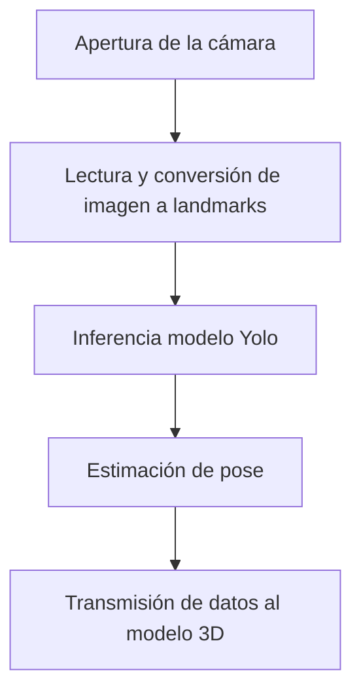

# Proyecto de Visión/3D + Control en Tiempo Real

Este repositorio contiene una aplicación Python para visión por computador y/o control de un modelo 3D en tiempo real (p. ej., OpenCV + YOLO + Panda3D).

## Requisitos


## Estructura 
```
assets/
  models/              # Modelos (.pt, .onnx, .pkl, etc.)
tests/                 # Pruebas unitarias (pytest)
src/                   # Archivos source del proyecto
main.py                # Punto de entrada por defecto 
pyproject.toml         # PEP 621 (opcional)
requirements.txt       # Requerimientos 
Makefile               # Tareas comunes
```

**Pipeline (resumen):**



## Primeros pasos
```bash
# 1) Instalar dependencias usando uv
make init

# 2) El comando init te creará una carpeta assets/models, acá tienes que colocar el modelo .glb para ejecutar la aplicación 

# 3) Ejecutar pruebas
make test

# 4) Ejecutar la app
make run                 

```

## Pruebas
Usamos `pytest`. y se puede ejecutar con:
```bash
make test
```

## Modelos
Coloca tus pesos/artefactos de modelos en `assets/models`. Ejemplos:
- `assets/models/model.glb`
- `assets/models/pose.onnx`

## Solución de problemas
- **Windows**: usa Git Bash para `make`. Alternativa: ejecutar los comandos dentro del Makefile manualmente en PowerShell.

## Licencia
MIT.
