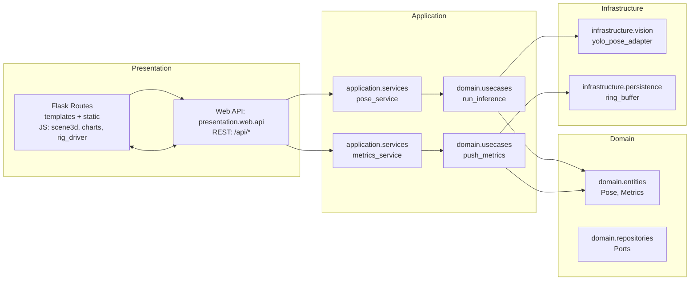
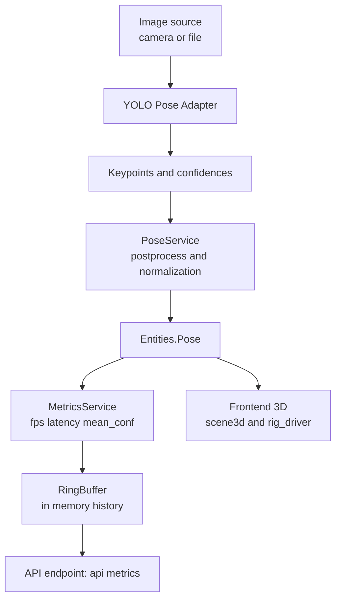

# Pose Estimation YOLO + Flask


Sistema de estimación de pose humana en tiempo real con **YOLO Pose** (Ultralytics) y backend **Flask**.  
Expone una API REST para inferencia y métricas, y sirve un frontend web estático (HTML/JS + Three.js) para visualización 3D y gráficas.

> **Estado actual**
>
> * Versión de Python: **3.12** (local con `uv`)  
> * Backend: **Flask (API REST)**  
> * Modelo: **YOLO Pose** (Ultralytics)  
> * Frontend: **HTML/JS (Three.js)** para vista 3D y métricas  
> * Flujo: fuente de imagen → inferencia → métricas → buffer → API/Frontend  

---

## Tabla de contenido

* [Demo](#demo)  
* [Arquitectura](#arquitectura)  
* [Estructura de código](#estructura-de-código)  
* [Requisitos](#requisitos)  
* [Arranque rápido](#arranque-rápido)  
  * [Opción A — Máquina local (Windows con `uv`)](#opción-a--máquina-local-windows-con-uv)  
  * [Opción B — Docker (opcional)](#opción-b--docker-opcional) 
* [Pruebas](#pruebas)
* [Licencia](#licencia)  
* [Créditos](#creditos)  

---

## Demo <a id="demo"></a>

La aplicación inicia un servidor Flask en `http://localhost:5000/`.  
El frontend permite visualizar la escena 3D y métricas de inferencia en tiempo real.

---

## Arquitectura <a id="arquitectura"></a>

### Diagrama de capas (Mermaid)


## Pipeline de inferencia y métricas

## Estructura de código <a id="estructura-de-código"></a>
```
src
├── application
│   └── services
│       ├── metrics_service.py
│       └── pose_service.py
├── domain
│   ├── entities.py
│   ├── repositories.py
│   └── usecases
│       ├── push_metrics.py
│       └── run_inference.py
├── infrastructure
│   ├── persistence
│   │   └── ring_buffer.py
│   └── vision
│       └── yolo_pose_adapter.py
└── presentation
    └── web
        ├── api.py
        ├── routes.py
        ├── static
        │   ├── favicon.ico
        │   ├── css
        │   │   └── styles.css
        │   └── js
        │       ├── app.js
        │       ├── charts.js
        │       ├── rig_driver.js
        │       ├── scene3d.js
        │       └── three_app.js
        └── templates
            └── index.html
```
## Requisitos <a id="requisitos"></a>
* Python 3.12
* Gestor de entornos:
  * Recomendado: uv (o pip/venv)
  * make
* Flask
* Ultralytics YOLO
* Docker Desktop (opcional)

## Arranque rápido <a id="arranque-rápido"></a>

> [!IMPORTANT]
> Antes de iniciar el aplicativo, asegúrate de tener la carpeta assets/models creada y colocar allí el modelo .glb.

### Opción A — Máquina local (Windows con uv) <a id="opción-a--máquina-local-windows-con-uv"></a>
``` bash
# Inicializar entorno
make init

# Ejecutar la app
make start

# Ejecutar pruebas
make test
```

### Opción B — Docker (opcional) <a id="opción-b--docker-opcional"></a>
``` bash
# Construir la imagen
docker build -t pose-flask:latest .

# Ejecutar el contenedor
docker run --rm -it -p 5000:5000 pose-flask:latest
```

## Pruebas <a id="pruebas"></a>

Ejecutar suite de pruebas:

``` bash
make test
```

Incluye verificaciones de:

* / (carga y contiene marcadores esperados).
* /favicon.ico (200 o 204).
* /api/metrics (JSON válido, maneja args).
* /models (lista archivos).
* /models/<archivo> (404 si no existe).

## Licencia <a id="licencia"></a>

Este proyecto está licenciado bajo la MIT License.
Consulta el archivo LICENSE para más detalles.

## Créditos <a id="creditos"></a>

### Enlace de Trello
https://trello.com/invite/b/68bbd2c839caa8243c9217ed/ATTI00fd9cd2558bf13eaea42f91ad976f04C948752F/desarrollo-de-proyectos-de-ia

### Desarrolladores

- Andres Felipe Aristizabal — https://github.com/Felipe-Aristizabal
- Jose David Escobar — https://github.com/JDEPAP2
